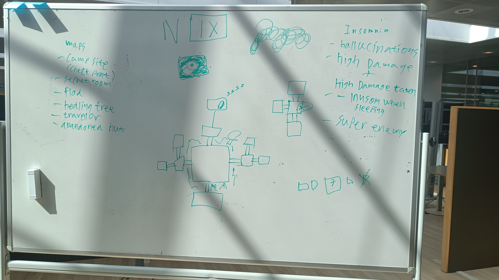

# Sleepless Forest

## Flow-diagram

## Dokumentation

**Spiller**

Spilleren er opsat som et game object, der instantierer forskellige scripts. Spilleren har en Rigidbody 2D or Box Collider 2D, så den påvirkes af Unitys fysik og kan kollidere med andre objekter, f.eks. spillets vægge eller fjenderne. Spilleren er også tilknyttet et Weapon object med et tilsat Firepoint, som tillader spilleren at skyde efter fjenderne. Dette Weapon object instantierer bullets baseret på en prefab og skyder dem ud fra det tilsatte Firepoint. Derudover har spilleren et Player Movement script, som tillader den at bevæge sig, et Player Camera, som sørger for at kameraet bevæger sig sammen med spilleren, og et Player Stats script, som gør at spilleren kan tage skade og kan dø. 

**Enemies**

Enemies har, ligesom spilleren, et stats script (kaldt Enemy Stats), der holder styr på deres health points og gør, at de kan tage skade og dø. Enemies er opsat som et prefab, så de kan instantieres flere gange ud fra et enkelt game object. Denne prefab benytter samme system som spilleren til at instantiere bullets, som den kan skyde med ud fra et Firepoint. Denne skydefunktion virker med at fjenden også har en firepoint som skyder sin egne prefab skud der kun kan skade spilleren. 

**Poison enemy**

Poison enemies angriber spilleren når dens hitbox støder ind i spillerens hitbox, ligesom de normale fjender, men poison enemies er anderledes i at de bruger en for-loop til at give skade over tid, hvilket gør at det ligner at de forgifter spilleren.

**Map Manager**

Mappet er autogeneret ved hjælp af et script, "MapManager.cs". Dette script har som mål at opstille verdenen når spilleren starter spillet. Selve metoden for dette er opbygget af flere skridt. Første del er at definere størrelsen på mappet. Anden skridt er at køre igennem alle fleterne på det, og at se hvor mange vægge der skal være, dette er gjort igennem en vægtet tilfældighed, hvilket betyder at det er cirka 50% for en dør i et rum, 40% for 2 døre og 10% for tre. Dette bliver gemt i arrays og bliver brugt til at bygge mappet ud fra. Hvilket er tredje skridt, at bygge væggene, den kører igennem alle de positioner hvor der kan være en væg og pladser enten en åben eller lukket væg, i forhold til hvad metoden i anden skridt har defineret. Fjerde skridt er så at bygge selve grundene og objekterne, disse opstillese fra prefabs og vælges også tilfældig, med den eneste regel af at der hvor spilleren starter og skal slutte, skal være et specifik slags felt.
Oven på dette har filen også en metode for at genstarte mappet, ved at trykke på "R", dette kan bruges til at teste kortet, men vil i fremtiden kunne køres af spillet når et nyt niveau bliver nået.

## Tidsplan

| Name     | Date                                     | Status      |
|----------|------------------------------------------|-------------|
| Sprint 1 | "September 4, 2023 → September 14, 2023" | Done        |
| Sprint 2 | "September 14, 2023 → November 3, 2023"  | In progress |

## Opgaver

| Name                        | Assign          | MoSCoW | Sprint nummer | Status      |
|-----------------------------|-----------------|--------|---------------|-------------|
| Basic level generation      | Vilius          | Must   | Sprint 1      | Done        |
| Player movement             | Casper          | Must   | Sprint 1      | Done        |
| Slingshot                   | Rune            | Must   | Sprint 1      | Done        |
| Ghoul Enemy                 | Casper          | Must   | Sprint 2      | In progress |
| Insomnia/health             | Casper          | Must   | Sprint 2      | In progress |
| Level generation: Continued | Vilius          | Must   | Sprint 2      | In progress |
| Melee weapon                | Rune            | Must   | Sprint 2      | In progress |
| Armor                       |                 | Would  | Not started   | Not started |
| Bear traps                  |                 | Could  | Not started   | Not started |
| Deeper insomnia mechanic    |                 | Should | Not started   | Not started |
| End-of-game boss            |                 | Should | Not started   | Not started |
| Lighting mechanic (Torch)   |                 | Could  | Not started   | Not started |
| Mini-map                    |                 | Should | Not started   | Not started |
| More enemy types            |                 | Should | Not started   | Not started |
| Potions                     |                 | Could  | Not started   | Not started |
| Progression: Sleeping       |                 | Must   | Not started   | Not started |
| Shop                        |                 | Would  | Not started   | Not started |
| Sleep demon (Insomnia boss) |                 | Could  | Not started   | Not started |
| Sprites                     |                 | Would  | Not started   | Not started |
| Treasure map                |                 | Should | Not started   | Not started |

## Opgavefordeling

Dette er opstillingen til start, når man er færdig med sin opgave, kan man gå over og hjælpe en kammerat eller begynde på en anden opgave:

- Spil verden opstilling: Vilius
- Fjende design: Rune
- Spiller: Casper

## Stil (Spil ideer)
- Skole (Ikke fordi vi vil begå skole skyderier)
    - Fjender
        - Zombie elever
        - Lærer
- Skov
    - Fjender
        - Ulve
        - Ugler
            - Charge attack
        - Ghouls (uhyggelige mennesker)
        - Uhyggelig mand
    - Bosser
        - Ild Demon
        - (Super enemy) “sleep demon”
    - Map
        - Å
        - Telt plads
        - Bålplads
        - Shop ? Tankstation
        - ? Fountain of youth (Fylde op på liv)
    - Funktioner
        - Lys
            - Lommelygte
            - Fakkel
        - Kister med skatter som nye våben
        - Udforsknings skat
        - Telt til at sove og komme op i dage
    - Våben
        - **Pind**
        - stærkere melee: økse
        - **Slangebøsse / Slingshot**
        - Bue
        - Bjørnefælder
    - Genstande (Items)
        - Æble
        - Skattekort
        - Armor
        - Potion
    
    
    

## Inspirationer

- Enter the gungeon
- Don’t starve

## Ideer

- Spil navn
    - Sleepless Forest

### Prioriteter (**MoSCoW)**

| Must | Should | Could | Want |
| --- | --- | --- | --- |
| Ghoul enemy | Treasure map | Potions | Armor |
| Level generation | Deeper insomnia mechanic | Bear traps | Shop |
| Insomnia/health | More enemy types | Sleep demon (insomnia boss) | Sprites |
| Basic weapons: stick and slingshot | End-of-game boss | Lighting mechanic (torch) |  |
| Progression: sleeping |  |  |  |

**Level generation**

*Levels* skal kunne genereres tilfældigt. Der skal være et bestemt antal i alt, hvorefter spillet sluttet med en *boss*. Levels genereres ud fra bestemte templates til *rooms*, som kan sammensættes på forskellige måder. Slutningen af et level markeres af en *bed*, som spilleren sover i for at komme videre til næste level.

**Ghoul enemy**

Ghoul enemies er zombieagtige og skal være standard fjenden. Dette betyder at det er de fjender der bliver set mest af gennem spillet. Ghoulsene behøver ikke at være virkelig stærke, da de skal være standard fjenden og alle andre fjender der laves vil blive sammenlignet med ghoulen. Ghoulsene skal være i spredt ud i hvert område, som vil opfordre spilleren til at være i bevægelse.  

**Insomnia/health**

Igennem spillet vil dit insomnia stige, især under angreb og lignende. Du vil have mulighed for at fjerne lidt af dit insomnia ved at sove, ellers kan du vælge at sidde ved bålet, hvor du så får lidt mere liv. En høj insomnia værdi kan lede til at du tager mere skade fra fjender, dog vil det også gøre at du skader dem med mere. En høj insomnia værdi kan også lede til større chance for at søvn dæmonen kommer frem. Dæmonen er den eneste fjende i spillet, som tager alle din liv fra dig når den dræber dig, hvilket betyder at fjenden er en stor risiko. Bossen er næsten umulig at dræbe, men hvis du for dræbt den, så får du et specielt våben. (Kunne fx have være et stort sværd med længere range)

**Basic weapons**

De to våben er en *****stick***** og et *********slingshot*********. ******Stick******  kan slå og dermed deale damage, mens *********slingshot********* dealer damage ved at skyde på fjenderne. Dog er dens range stadig begrænset. 

**Progression: sleeping**

For at kunne lave fremskridt i spillet skal der soves. Når spilleren er nået frem til et camp site, har de valget om at sove eller ej. Når spilleren vælger at sove så vil spilleren gå videre til næste dag, selvom det er konstant nat. Hvilken dag spilleren er på vil blive vist med romertal øverst på skærmen. En af disse dag vil være mærkeret, denne dag er hvor spilleren vil kæmpe imod bossen, hvis bossen bliver besejret vinder spilleren. Ud over at sove ved camp sitet så har spilleren også muligheden for at fortsætte uden at sove. Når spilleren ikke sover ved disse camp sites så forøger insomnia meteren.
